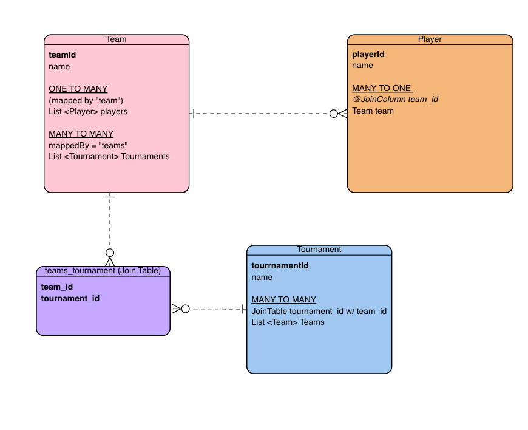
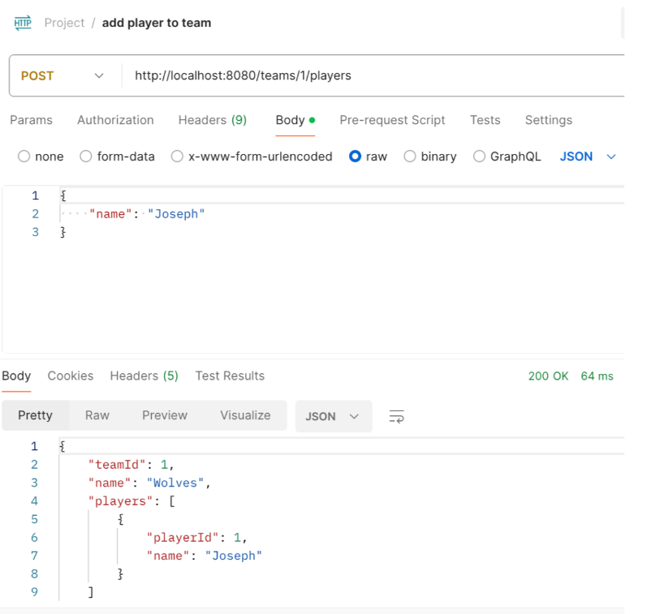
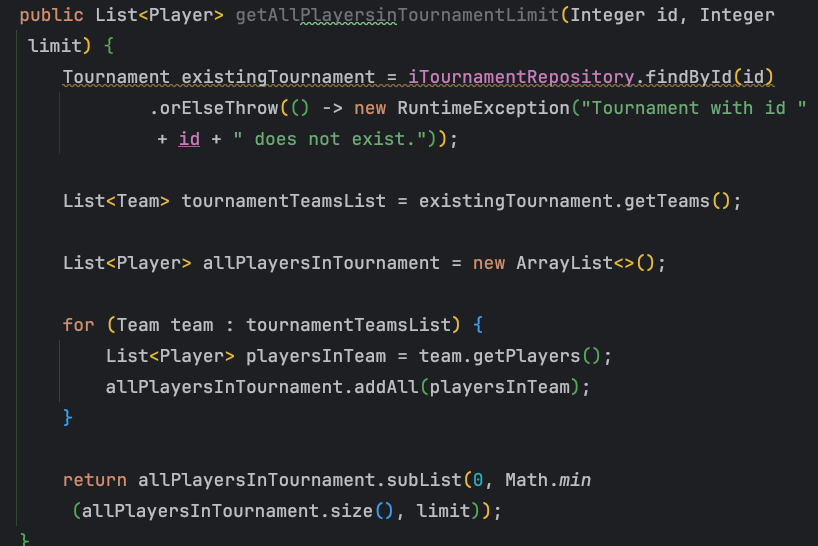
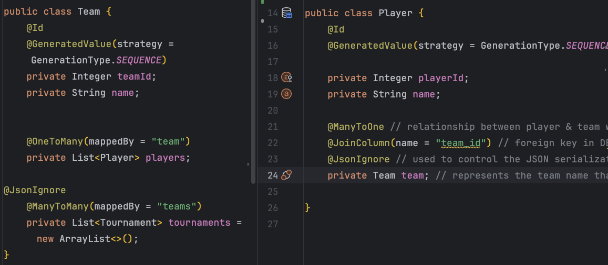
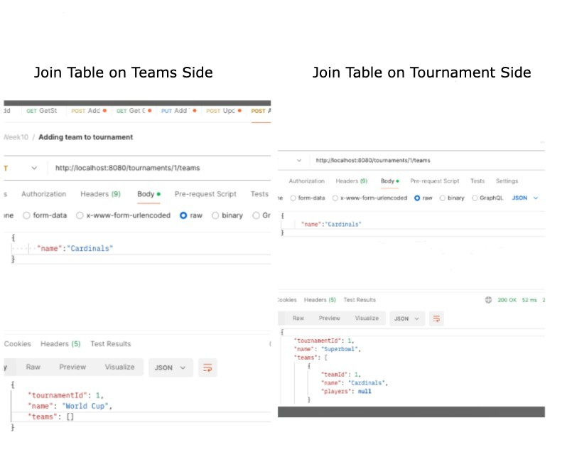

# League JPA Database App

---

# Intro

This pair project was completed mid-April 2024 as part of General Assembly's Bootcamp, during Week 10 in our course. The application utilizes the Spring Boot framework with the following dependencies: Spring Web, Spring Data JPA, an appropriate SQL database connector for postgres and also Lombok.

---

# Overview

The League Manager app is a basic backend tool for managing sports teams, players, and their participation in various tournaments. The core entities and their attributes are respectively as follows (and diagrammed out in ERD diagram below).

- Teams: id, name, list of players
- Players: id, name, team they play for
- Tournament: id, name, list of teams that compete in it



The attributes’ data types are defined with Object data types (i.e. capitalized Integer vs int). This is what allows us to not only have the flexibility to call more methods on them such as .toSring, but to also allow us to return null if they don’t exist.

For each of the core entities, we have REST controllers that handle HTTP requests and responses, and inject the corresponding services. The service layers define the business logic for each entity and provide methods for CRUD operations (create, retrieve, update, delete) and any additional functionality required. These services inject the needed repositories which extend Spring Data JPA’s JpaRepository. Lastly, we have the `aop` package that primarily allows us to log information.

Each of the aforementioned layers have Spring annotations on them, such as @RestController, @Service, and @Repository. Since methods are called on these beans (or instances), we ensure that the methods are not static. The return types of the method are either an instance of the entity such as `Team` or a list such as `List<Player>`, or with Delete methods- the return type is null, since nothing is returned when you find and delete say a team by id.

When testing these endpoints in Postman, we first created our playrs, teams, and tournaments. Then, we assigned players to teams, and teams to tournaments. With everything set up, we could test our endpoint calls. We saved these queries along with their asssociated request bodies on Postman, allowing for testing ease (as our database application properties was set up on create-drop. This way, upon re-run we could simply re-send the request bodies' information.)



---

# Functionality

## .save

In the service layers, you will see how `.save` is called on the injected repository for post mapping (add) and put mapping (update) operations. The primary reason is because we want to save (aka "persist") the added and/or updated entity to its respective database.
For example, when we update a team’s name and Tournaments they play in, after those edits are made to that team, we use `.save` to save that team (which now has an update name and/or tournament’s list) to its team database.

public Team updateTeam(Integer id, Team team) {
Team existingTeam = iTeamRepository.findById(id).orElseThrow(() -> new RuntimeException("Team with id " + id + " does not exist."));
existingTeam.setName(team.getName());
existingTeam.setTournaments(team.getTournaments());
return iTeamRepository.save(existingTeam); // make sure we save the updated team info back to the team database
}

The second reason we use .save is to ensure that the entity has an established relationship.

The Player entity has a join column (on team_id) that establishes a relationship with the Team entity. Therefore, we need to ensure that the Player entity has an id assigned, as this id will be used as the value for the join column referencing the associated Team. That is why we have the line ‘ iPlayerRepository.save(player)’ in our method of `addPlayerToTeam` (detailed in [One To Many](#One-to-Many) section below.
You can also see this in `addTeamToTournament` where we write ` iTeamRepository.save(team)`

## Aspect Oriented Programming

For our `aop` package, the `LoggingAspect` class has a @Pointcut which indicates to the program to “spy” on all Service classes in our `com.example.leagueapp` package. \*Cue James Bond music! ;) Before and after the methods are executed, the time is logged in milliseconds, allowing us to track data how long the API calls take to complete. For example, if a user wants to get all players by an id, we can then see how long that takes to execute.

In the `TournamentLoggingAspect` class, we explore the concept of `@Around` notation which is used to intercept and modify the behavior of a specific method. . `joinPoint` is the method being intercepted, in this case- we modify the `addTournament` method in the Tournament service class. A user may input `Superbowl`, but this name is then altered, as it’s intercepted by the `logAddTournament`. Then, ‘`joinPointProceed' indicates that the normal flow of code continues after this interception, which means the altered name is then saved to the tournament database (through our service method’s dependency on the repository).

## Pagination

A bonus was adding a limit parameter to the endpoint that retrieves a list of all players in a tournament, i.e. `/tournaments/1/players?limit=5`.
We initially resolved this by finding the tournament by the specific id, and then getting all the teams in that tournament. Then, we initialize an empty `tournamentTeamList` array.. We iterate through the list of teams in that tournament, and with each iteration- save the players to a list- and those resulting lists are then added back to `tournamentTeamList`. Then, from that list, we could return a sublist that displays all the players from index position 0 up to the limit the user chose.



### JPQL

We learned a more efficient way is through JPQL (which is Java’s way of querying). Since we are fetching players, we wrote our query in the `IPlayerRepository`. `@Query` annotation is used to indicate it’s a custom query method. The code below means we select all of the players `p` from the `Player` table, and then join the Player entity to Team entity, which is then joined with its associated tournament entity.

```
public interface IPlayerRepository extends JpaRepository<Player, Integer> {
    @Query("SELECT p FROM Player p " +
            "JOIN p.team t " +
            "JOIN t.tournaments tt")List<Player> findAllPlayersInTournamentWithLimit(Integer limit);
}

```

Then, we can simply call it as follows in the Service layer.
(Note: We were able to use the same method name as the initial method we created due to method overloading. It works because we provide it with different parameters. Whereas our initial method requires both a tournament id and user limit, our new method only requires the user limit.)

```
 public List<Player> getAllPlayersinTournamentLimit (Integer limit)
    {
       return iPlayerRepository.findAllPlayersInTournamentWithLimit(limit);
    }
```

### Query Endpoint

In `TournamentController`, we can then define the endpoint. Notice how we use a `value` and `params`. This is also why I can use a pre-existing endpoint of `/tournaments/{id}/players`- as the parameter is what differentiates it. In other words, this additional parameter specifies that this endpoint will only be mapped if a request includes a query parameter named limit

```@GetMapping(value ="/tournaments/{id}/players", params= {"limit"})

    public List<Player> getAllPlayersInTournamentLimit(@PathVariable Integer id, @RequestParam(defaultValue = "10") Integer limit) {
        return tournamentService.getAllPlayersinTournamentLimit(limit);
    }
```

## Error Handling

We built in error handling to allow users to interact with only existent objects. That is, for example, we wanted to prevent users from trying to delete a non-existent player from a team, or trying to add a player to a non-existent team. This means using the `RunTimeException` syntax for our Optionals.

Optionals are the default data-type result when using the universal methods available in Spring JPA, such as `findById.`Optionals means that the id (in this case the player idd) may or may not exist. We provide a Runtime exception should that player not exist along with a message to the user to advise of this in the example code block below.

‘’’
public Player getPlayerById(Integer id) {
return iPlayerRepository.findById(id).orElseThrow(() -> new RuntimeException("Player with id " + id + " does not exist."));
}
‘’’

# What I Learned

## Bidirectional Navigation

Teams and Players have a one-to-many relationship, or in other words have a unidirectional relationship. You have to set both entities "to each other". When doing post-mapping, say adding players to team- we have to remember to not only set the player to a team, but also the team to that player. 



In this code block, you can see after we find the team by Id that we want to add the player to, we set (“assign”) that team to our player provided in the JSON body. We also add the player to the list of players under that team.

```
public Team addPlayerToTeam(Integer id, Player player) {
        Team existingTeam = iTeamRepository.findById(id).orElseThrow(() -> new RuntimeException("Team with id " + id + " does not exist."));

        player.setTeam(existingTeam);

        //saving the player we want to add to the player database
        // this way player has an id
        iPlayerRepository.save(player);

        //existing list of players under the team with that id
        List<Player> players = existingTeam.getPlayers();

        //adding that player to that existing list of players under team with that id
        players.add(player);

        existingTeam.setPlayers(players);

        //saving that team with the newly added player to the team database
        return iTeamRepository.save(existingTeam);
}    
```

We do this "two-way" set to allow for bidirectional navigation. We many need to query from players to team (i.e. to know which team a player belongs to). Vice versa, we may need to query from team to players (i.e. we need to know what list of players belong to a team). This "two-way set" would be unnecessary if you didn't need bidirectional navigation.

On the other hand, for many-to-many relationships, we only have to worry about setting an entity to another (vs both ways as we saw above).
This is because, with many-to-many, the join table established a bidirectionality between both entities. 

## JSON Ignore

We put the `@JsonIgnore` on the Player entity over the `Team team`, because a player can exist without a team (whereas a team can’t exist without players). Another way to think of it is we don’t need to show the team when we query a player; instead, it would be more helpful to show the players when we query a team.

## Many to Many

Tournaments and teams have a many-to-many relationship. In our app, we query most frequently from Tournaments, such as adding teams to tournaments, or getting all players in a tournament. When I tested adding a team to a tournament, initially, I noticed that the team array was returning blank. This prompted me to move the Join Table logic to the Tournament entity, and the `mapped by` on the Team entity. This way, when we query tournament, it joins with team and is properly able to display the array.



---

# Thinking Ahead

## JPQL

As briefly mentioned in [JPQL](#JPQL) section above, using JPQL and the @Query annotation method allows not only for cleaner code, but it also allows for more efficiency. Manipulating and streaming lists may cause the app to crash if dealing with large amounts of data. Implementing JPQL would be something we would consider adding into our other methods, if our hypothetical league database were to become larger. 

Note: JPQL would be used for more complex joins. For simpler joins, as our repositories extend JPA, we are able to use the pre-existing query methods by starting to type say `findplayersby...` (allowing us to an extension of SQL vs having to write out list streams).

## removeIf

For removing Players from Teams, I had found the team by id and then saveed the existing list of players under that team with that id to a variable called `teamPlayersList`. From that list, I then filter out the player with the corresponding playerId (provided as a PathVariable) and save that to another list. We then update the list of Players on that team to be equal to that list without the deleted player.

That's a lot of steps! I could have shortened that using `removeIf`, which is a method available for lists in Java, and it would remove all elements that from the list that satisfy that condition.

The updated code could look something like this:

```
public Team deletePlayerFromTeam(int id, int playerID) {
        Team team = teamRepository.findById(id).orElseThrow(() -> new RuntimeException(...));

        team.getPlayers().removeIf(player -> player.getId() == playerID);
        return teamRepository.save(team);
    }
```

You can see how the Player elements would be removed from that team's list of players if they match the `playerId` that needs to be taken out. As such, with any other "delete from list" methods in my project, I could apply `removeIf`.

## Flatmap

In my [Pagination](#Pagination) section, the sublist method I wrote to get a list of all Players from a Tournament was as follows: it gets a list of all teams in that tournament, and then it iterates through the list of teams in that tournament, and for each team return the list of players. The resulting players from each iteration is then aggregated to a `List<Player>`.

This logic can also be acheived via `flatmap`- which allows us to convert a list of lists to a single list. In this code below, we first get the list of teams in the tournament and then call `flatmap` on it. `flatmap` is saying for each team that is iterated through, we get each of the players and stream them to a list, and then flatten those lists of playres into single list of players.

You can see how this can allow cleaner and also more efficient code.

```
public List<Player> getTournamentPlayers(int id, int limit) {
        Tournament tournament = tournamentRepository.findById(id).orElseThrow(() -> new RuntimeException(...));

        List<Player> tournamentPlayers = tournament.getTeams().stream()
                .flatMap(team -> team.getPlayers().stream()).toList();

        return tournamentPlayers
                .subList(0, (limit <= tournamentPlayers.size()) ? limit : tournamentPlayers.size())
                .stream().toList();
}
```
## Required Annotation
The function for getting all the players in a tournament and the one for getting all players in a tournament but with a limit of how mnay to display at once can be combined. To keep our code DRY, we can just use the latter function and add 'required = false` to the @RequestParam annotation.